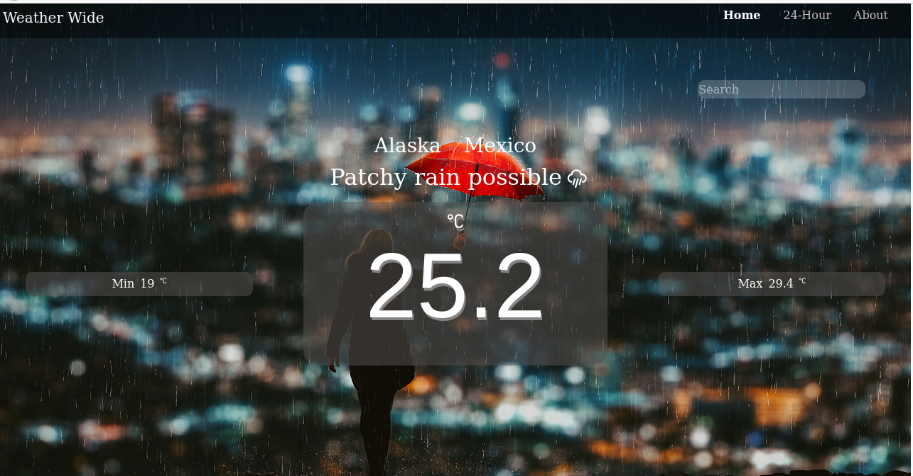
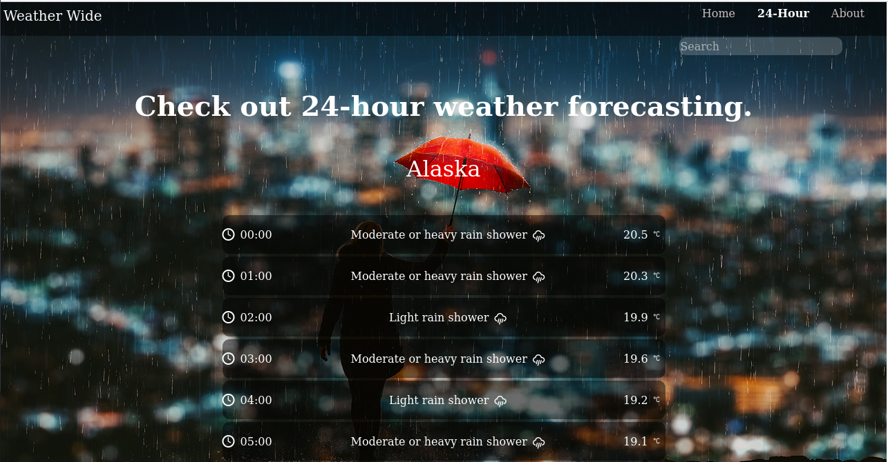
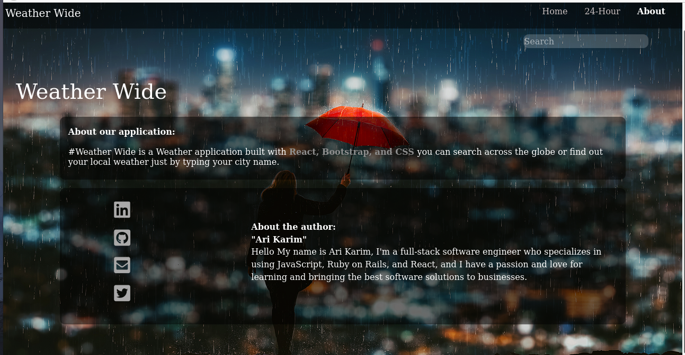

# Weather-App

Weather Wide is a weather application built with `React, Bootstrap, and CSS`, you can search across the globe or find out your local weather just by typing your city name.<br>

  


## Screenshots of the app.

### Home Page


### 24-Hour Page


### About Page


[Live Demo Link](https://arikarim.github.io/React-Weather/)

## Built With

- React
- Bootstrap
- Css

## Prerequisities

To get this project up and running locally, you must follow the steps from the [getting started section](#getting-started).

## Getting Started

**To get this project set up on your local machine, follow these simple steps:**

**Step 1**<br>
Navigate through the local folder where you want to clone the repository and run: <br>

```
git clone https://github.com/arikarim/Weather-App/tree/main 
```
It will clone the repo to your local folder.

**Step 2**<br>
- Cd inside the project

- open index.html in your browser.


## 🤝 contributing

contributions, issues, and feature requests are welcome!<br/>feel free to check [issues page](https://github.com/arikarim/Weather-App/issues).

## Author

- GitHub: [@arikarim](https://github.com/arikarim)
- LinkedIn: [AriKarim](https://www.linkedin.com/in/ari-karim-523bb81b3)

## 🙋‍♂ show your support

give a ⭐️ if you like this project!

## 📝 license


This project is [MIT](LICENSE) licensed.
